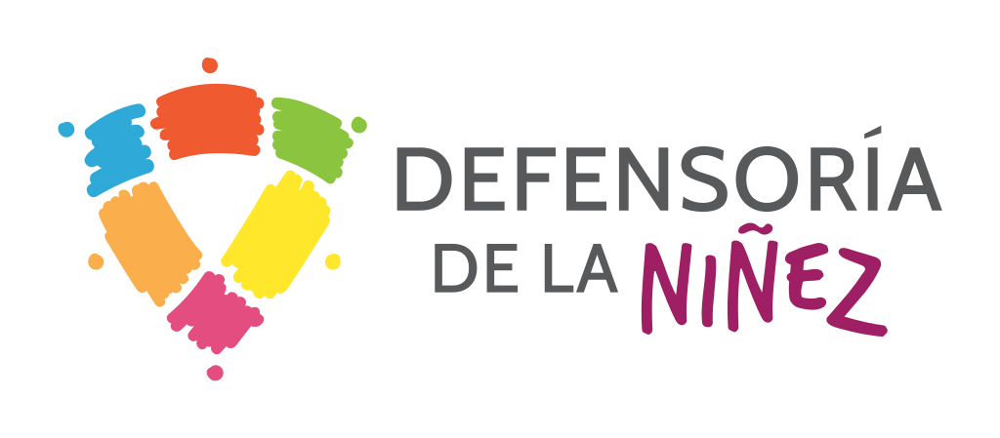
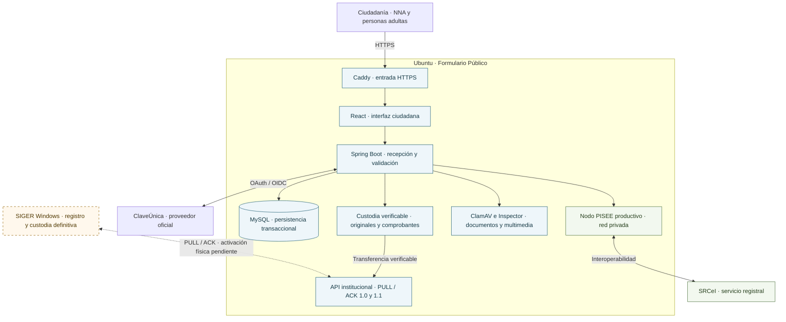

<p align="center">
  
</p>

<h1 align="center">Plataforma Digital de Comunicaciones</h1>
<p align="center"><strong>Defensoría de la Niñez</strong><br />Formulario Público e interoperabilidad con SIGER</p>

<p align="center"><a href="docs/CHECKPOINT_PRODUCCION_SIGER_2026-11-04.md"><strong>RC1 publicado · recepción protegida</strong></a><br />Estado documentado al 04/11/2026</p>

<p align="center"><a href="#calidad-y-verificación">Calidad</a> · <a href="#estado-del-proyecto">Estado</a> · <a href="#qué-hace-la-plataforma">Capacidades</a> · <a href="#arquitectura">Arquitectura</a> · <a href="#seguridad-y-privacidad">Seguridad</a> · <a href="#desarrollo">Desarrollo</a> · <a href="#documentación">Documentación</a></p>

Una plataforma para **ingresar, validar, recibir y transferir Comunicaciones de la ciudadanía**, con atención a niñas, niños, adolescentes y personas adultas. Combina una interfaz accesible con interoperabilidad estatal, custodia documental y entrega institucional verificable.

El **Formulario Público** es el componente ciudadano y receptor transitorio en Ubuntu. **SIGER** es el destino de registro, gestión y custodia institucional definitiva en Windows. Desarrollo e implementación: **Nexbyte SpA**.

## Ingeniería al servicio de la protección de derechos

Una Comunicación necesita llegar a la institución con sus antecedentes completos y trazables. La plataforma simplifica ese ingreso para NNA y personas adultas: aportar documentos, revisar y obtener un comprobante, sin exigir ClaveÚnica a quienes utilizan identificación declarada.

La identidad digital y la interoperabilidad estatal apoyan la validación sin exponer antecedentes registrales al navegador. La inspección, los hashes y las firmas protegen la integridad de lo recibido; un contrato explícito prepara su transferencia a SIGER para la gestión institucional, con procedencia y responsabilidades distinguibles.

## Calidad y verificación

<p align="center">
  <a href="docs/PUBLICACION_RC1_MANIFIESTO_2026-11-04.json"></a>
  <a href="docs/EVIDENCIA_SHOWCASE_RC1_2026-11-04.md"></a>
</p>
<p align="center">
  <a href="docs/PUBLICACION_RC1_MANIFIESTO_2026-11-04.json"></a>
  <a href="docs/PUBLICACION_RC1_MANIFIESTO_2026-11-04.json"></a>
  <a href="docs/PUBLICACION_RC1_MANIFIESTO_2026-11-04.json"></a>
</p>

**Resultados documentados al 04/11/2026.** El total incluye categorías distintas y **tres omisiones opcionales** (dos backend y una Python). Frontend corresponde al empaquetado validado con código idéntico, según el manifiesto. No es una medida de cobertura ni un acumulado de ejecuciones CI. [Alcance y fuentes](docs/EVIDENCIA_SHOWCASE_RC1_2026-11-04.md).

**CI Linux / Windows / Docker** · estado actual del workflow de `main`:

[](https://github.com/chashmdai/formulario-web/actions/workflows/ci.yml?query=branch%3Amain)

| Linux · aplicación | Windows · consumidor | Docker · distribución |
| :--- | :--- | :--- |
| [React, Spring/H2 y controles Python](https://github.com/chashmdai/formulario-web/actions/runs/41881222055/job/126753894040) | [NTFS, criptografía y recuperación con fixtures](https://github.com/chashmdai/formulario-web/actions/runs/41881222055/job/126753893660) | [Compose, proxy y construcción de artefactos](https://github.com/chashmdai/formulario-web/actions/runs/41881222055/job/126753893446) |

Los enlaces de la tabla corresponden a la ejecución verificada del 04/11; el badge refleja el resultado conjunto más reciente de `main`. CI aislada no acredita una transferencia física productiva a SIGER. [Ejecución y antecedentes](docs/EVIDENCIA_SHOWCASE_RC1_2026-11-04.md#github-actions).

---

## Estado del proyecto

> [!NOTE]
> **RC1 publicado · 04/11/2026** — [formulario.defensorianinez.gob.cl](https://formulario.defensorianinez.gob.cl). Recepción habilitada para personas autorizadas mediante contraseña temporal. Estado y evidencias: [checkpoint operativo](docs/CHECKPOINT_PRODUCCION_SIGER_2026-11-04.md) · [manifiesto de publicación](docs/PUBLICACION_RC1_MANIFIESTO_2026-11-04.json).

**Producción · corte documentado del 04/11/2026**

<p>
  <a href="docs/CHECKPOINT_PRODUCCION_SIGER_2026-11-04.md"></a>
  <a href="docs/CHECKPOINT_PRODUCCION_SIGER_2026-11-04.md"></a>
  <a href="docs/PUBLICACION_RC1_MANIFIESTO_2026-11-04.json"></a>
</p>

**Integraciones e integridad · implementación y alcance**

<p>
  <a href="docs/CHECKPOINT_PRODUCCION_SIGER_2026-11-04.md"></a>
  <a href="docs/EVIDENCIA_SHOWCASE_RC1_2026-11-04.md"></a>
  <a href="contratos/formulario-completo-multimedia-v1.1.md"></a>
</p>
<p>
  <a href="docs/CHECKPOINT_PRODUCCION_SIGER_2026-11-04.md"></a>
  <a href="contratos/formulario-completo-multimedia-v1.1.md"></a>
</p>

Estos indicadores enlazan a evidencia fechada: **no son monitores de disponibilidad ni sellos de certificación**. Los límites efectivos son:

| Componente | Estado acreditado |
| :--- | :--- |
| Formulario ciudadano | Recorridos de adultos y NNA publicados; recepción y adjuntos habilitados. |
| Acceso temporal | Contraseña validada en servidor hasta el **15/12/2026, 00:00 America/Santiago**. Después continúa el mismo RC1 bajo la autorización vigente y los controles operacionales. |
| PISEE / SRCeI | Nodo productivo integrado; consulta real desde Java acreditada. Los antecedentes registrales permanecen en el backend. |
| ClaveÚnica | Flujo oficial conectado al proveedor. **Autenticación personal completa aún no acreditada**. |
| PULL / ACK 1.0–1.1 | Productor y autenticación técnica preparados. **Recuperación cerrada** hasta incorporar la identidad ACK de SIGER Windows. |
| SIGER Windows | **E2E físico de esta instalación pendiente**. La recepción en Ubuntu no depende de su disponibilidad inmediata. |

Las Comunicaciones recibidas permanecen en custodia durable, pendientes de registro en SIGER. El comprobante ciudadano no equivale a un folio COM ni a un ACK institucional.

## Qué hace la plataforma

| Para la ciudadanía · Formulario Público | Para la institución · interoperabilidad con SIGER |
| :--- | :--- |
| Acceso diferenciado para NNA y personas adultas, con o sin ClaveÚnica. | Recepción transaccional, idempotencia y custodia temporal de originales. |
| Recorridos de consulta, promoción y vulneración; personas e instituciones relacionadas. | Identidad y procedencia de atributos: declaración ciudadana y antecedentes registrales. |
| Identificación nacional o extranjera, contactos y preferencias de tratamiento. | Documentos completos 1.0/1.1, hashes SHA-256 y firmas Ed25519. |
| Documentos y multimedia inspeccionados, revisión y correcciones antes del envío. | Reserva PULL, descarga, reintentos y confirmación mediante ACK firmado. |
| Comprobante digital firmado; interfaz adaptable a móviles y escritorio. | En SIGER: COMMIT previo al ACK, folio COM y custodia definitiva; validación física pendiente. |

Las notificaciones institucionales por correo corresponden a SIGER; Microsoft Graph no es una dependencia del Formulario.

## Arquitectura


```mermaid
flowchart TB
    Ciudadania["Ciudadanía · NNA y personas adultas"]

    subgraph Ubuntu["Ubuntu · Formulario Público"]
        Caddy["Caddy · entrada HTTPS"]
        React["React · interfaz ciudadana"]
        Spring["Spring Boot · recepción y validación"]
        MySQL[("MySQL · persistencia transaccional")]
        Custodia["Custodia verificable · originales y comprobantes"]
        Inspeccion["ClamAV e Inspector · documentos y multimedia"]
        API["API institucional · PULL / ACK 1.0 y 1.1"]
        Nodo["Nodo PISEE productivo · red privada"]
        Caddy --> React
        React --> Spring
        Spring --> MySQL
        Spring --> Custodia
        Spring --> Inspeccion
        Custodia -->|Transferencia verificable| API
        Spring --> Nodo
    end

    CU["ClaveÚnica · proveedor oficial"]
    SRCEI["SRCeI · servicio registral"]
    Windows["SIGER Windows · registro y custodia definitiva"]

    Ciudadania -->|HTTPS| Caddy
    Spring <-->|OAuth / OIDC| CU
    Nodo <-->|Interoperabilidad| SRCEI
    Windows <-.->|PULL / ACK · activación física pendiente| API

    classDef principal fill:#eef6fa,stroke:#236176,color:#153945
    class Caddy,React,Spring,MySQL,Custodia,Inspeccion,API principal
    classDef operativa fill:#f2f8ef,stroke:#527543,color:#253e1b
    class Nodo,SRCEI operativa
    classDef pendiente fill:#fff8ed,stroke:#946200,stroke-dasharray:5 5,color:#503800
    class Windows pendiente
```

Azul: componentes desplegados. Verde: interoperabilidad registral operativa. Ámbar y trazo discontinuo: conexión física SIGER pendiente. Las líneas continuas representan componentes e integraciones instalados; las discontinuas, el intercambio Windows pendiente de activación. ClaveÚnica tiene el flujo implementado, con el límite de validación indicado arriba. React se distribuye dentro del JAR; las consultas registrales se ejecutan exclusivamente desde el backend.

**Entrega verificable:** recepción y comprobante → reserva y descarga → verificación y COMMIT en SIGER → ACK firmado. Los fallos o reintentos no deben crear duplicados ni confirmaciones ficticias. [Contrato multimedia](contratos/formulario-completo-multimedia-v1.1.md).

## Tecnologías

<p align="center">
  
  
  
  
  
</p>

| Capa | Implementación |
| :--- | :--- |
| Experiencia ciudadana | React 19, TypeScript, Vite; pruebas con Vitest y Testing Library. |
| Servicios y datos | Java 25, Spring Boot 4.1, JDBC, Flyway; MySQL 8.4 y H2 para pruebas. |
| Infraestructura | Linux/Ubuntu, Docker Compose, Caddy y HTTPS. |
| Inspección | ClamAV y herramientas de inspección documental aisladas en Inspector. |
| Identidad e integridad | ClaveÚnica, PISEE/SRCeI, Ed25519 y SHA-256. |
| Consumidor institucional | Agente Java, PowerShell y entorno Windows Server para SIGER. |

## Seguridad y privacidad

- **Autenticación y declaración separadas.** Consultar SRCeI no autentica a la persona. El adulto sin ClaveÚnica conserva su condición de identidad declarada.
- **Datos registrales protegidos.** Permanecen en backend, asociados al recorrido y su sesión. Se solicitan solo los campos faltantes y se conservan procedencia y discrepancias de correcciones voluntarias.
- **Accesos independientes.** Sesiones seguras, CSRF, límites de consulta y protección temporal ciudadana; Bearer técnico y firmas para el intercambio institucional.
- **Originales verificables.** Inspección antes de aceptación, hashes de integridad, comprobantes y documentos firmados, reservas e idempotencia.
- **Operación recuperable.** Secretos fuera de Git e imágenes, configuración externa, respaldos cifrados y procedimientos de restauración y reversión documentados.

Estos mecanismos describen la implementación; no constituyen una certificación externa de cumplimiento. [Arquitectura y límites de confianza](docs/ARQUITECTURA_RECEPTOR_TRANSITORIO.md).

## Desarrollo

En un **clon de desarrollo independiente**, con Linux/POSIX, JDK 25, Maven 3.9+ y Node 24.15+, desde la raíz:

```bash
npm --prefix formulario-publico/front ci
npm --prefix formulario-publico/front run lint
npm --prefix formulario-publico/front test -- --maxWorkers=2
npm --prefix formulario-publico/front run build

mvn -B -ntp -f formulario-publico/backend/pom.xml \
  -Dsiger.build.directory="$(pwd)/.local/desarrollo-target" \
  '-Dtest=*Test,!Carga*Test' verify
```

Esta batería utiliza frontend y pruebas backend/H2 sin credenciales gubernamentales ni SIGER. No despliega ni migra la base del servicio. Para trabajar la interfaz: `npm --prefix formulario-publico/front run dev`; Vite usa localhost y requiere un backend local separado para las API. No sustituye HTTPS ni los callbacks oficiales.

<details>
<summary><strong>Configuración y pruebas de integración</strong></summary>

Los ambientes usan configuración externa y secretos propios. MySQL requiere un esquema sintético dedicado; los ensayos con proveedores reales necesitan autorización y finalidad. No utilizar bases, certificados o credenciales productivas para las pruebas automáticas.

La [referencia técnica conservada](docs/README_TECNICO_HISTORICO_2026-11-04.md#8-compilar-probar-y-operar) detalla compilación y pruebas. La [guía Ubuntu](docs/INSTALACION_UBUNTU_DOCKER.md) conserva los procedimientos de instalación por etapas; el [checkpoint del 04/11](docs/CHECKPOINT_PRODUCCION_SIGER_2026-11-04.md) determina el estado operativo vigente.

</details>

## Documentación

### Evidencias de ingeniería

| Lectura | Referencia |
| :--- | :--- |
| Resultados de pruebas | [680 casos: desglose y alcance](docs/EVIDENCIA_SHOWCASE_RC1_2026-11-04.md#resultados-del-corte-rc1) |
| GitHub Actions | [Workflow y ejecuciones reales](https://github.com/chashmdai/formulario-web/actions/workflows/ci.yml?query=branch%3Amain) · [corte CI verificado](docs/EVIDENCIA_SHOWCASE_RC1_2026-11-04.md#github-actions) |
| Seguridad e integridad | [Controles y límites acreditados](docs/EVIDENCIA_SHOWCASE_RC1_2026-11-04.md#implementación-y-límites) · [contrato firmado](contratos/formulario-completo-multimedia-v1.1.md) |
| **Estado vigente y siguiente paso con Windows** | [Checkpoint productivo y continuidad SIGER](docs/CHECKPOINT_PRODUCCION_SIGER_2026-11-04.md) |
| Artefactos, imágenes y evidencia | [Manifiesto de publicación RC1](docs/PUBLICACION_RC1_MANIFIESTO_2026-11-04.json) |
| Diseño y responsabilidades | [Receptor transitorio](docs/ARQUITECTURA_RECEPTOR_TRANSITORIO.md) · [separación de aplicaciones](docs/ARQUITECTURA_APLICACIONES.md) |
| Contratos institucionales | [Índice contractual](contratos/README.md) · [Formulario completo y multimedia 1.1](contratos/formulario-completo-multimedia-v1.1.md) · [identidad 1.1](contratos/identidad-componentes-v1.1.md) |
| Identidad e interoperabilidad | [Guía ClaveÚnica, PISEE y SIGER](docs/INTEGRACIONES_UBUNTU.md) · [privacidad SRCeI](docs/CHECKPOINT_PRODUCCION_SIGER_2026-11-04.md#evidencia-y-límites-de-lo-acreditado) |
| Operación y recuperación | [Respaldo y reversión RC1](docs/RC1_OPERACION_RESPALDO_REVERSION_2026-11-03.md) · [procedimientos vigentes](docs/CHECKPOINT_PRODUCCION_SIGER_2026-11-04.md#respaldo-arranque-y-reversión) |
| Documentos y consumidor Windows | [Operación multimedia](docs/OPERACION_MULTIMEDIA.md) · [agente institucional y laboratorio](agente-custodia/README.md) |
| Historia e ingeniería detallada | [README técnico anterior, conservado](docs/README_TECNICO_HISTORICO_2026-11-04.md) |

Las guías históricas conservan su fecha y alcance. Para operar la instalación publicada prevalecen el checkpoint vigente y sus autorizaciones; las pruebas de laboratorio no acreditan por sí mismas una transferencia productiva a SIGER.

---

**Institución destinataria:** Defensoría de la Niñez.<br />
**Desarrollo e implementación:** Nexbyte SpA.<br />
**Plataforma:** Formulario Público e interoperabilidad con SIGER.
